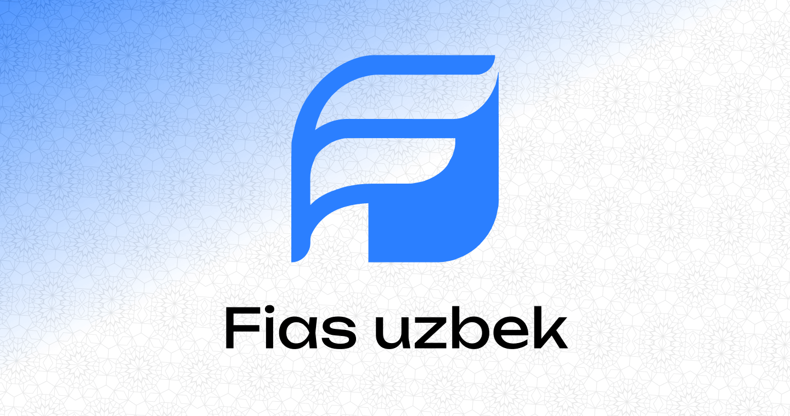

**FIAS** is an open-source organization focused on building modern, accessible, and high-quality software solutions. Our mission is to support developers and communities through free and open tools, educational resources, and innovative applications.

## What We Do

- Develop open-source libraries, tools, and web/mobile applications
- Promote modern software architecture and clean code practices
- Contribute to developer education and community growth
- Encourage collaboration and sharing knowledge

## Projects

We work on a variety of projects including:
- Web and mobile development tools
- UI/UX component libraries
- Educational platforms
- Utility libraries for faster and cleaner development

## Contact

- [Telegram](https://t.me/usmanov_dev)
